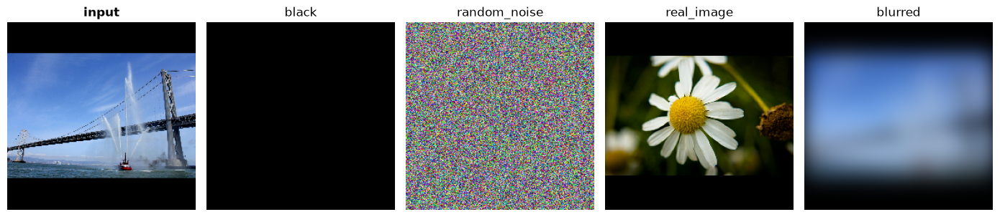
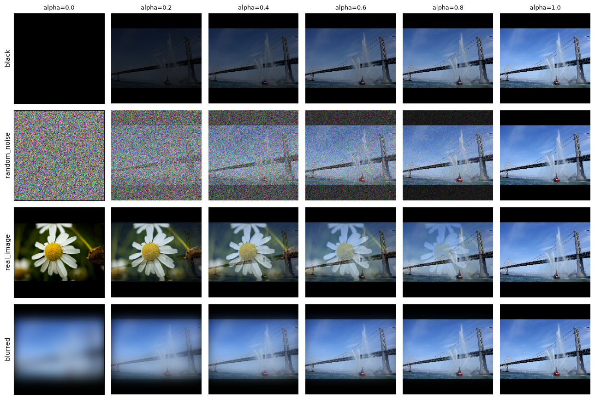
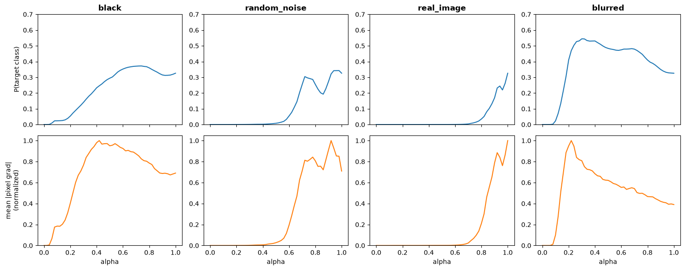
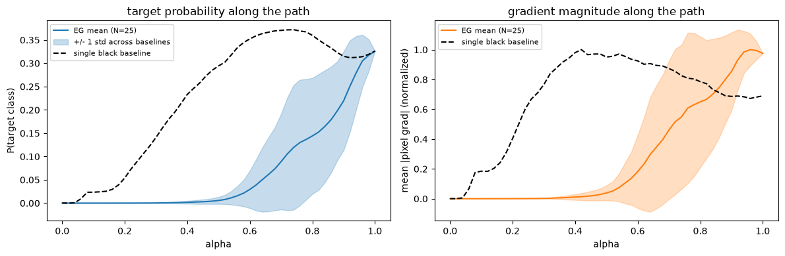
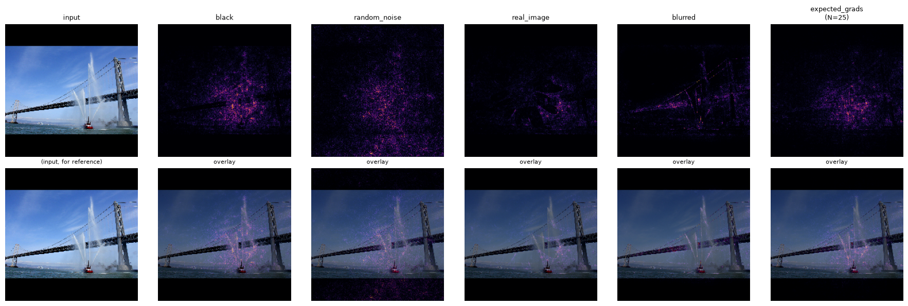

# Your Integrated Gradients baseline is doing more work than you think

*Part of an ongoing series working through interpretability methods. Code and
notebooks: [ViT-Interpretability](https://github.com/KeremKurban/ViT-Interpretability).*

Integrated Gradients is usually introduced with a single throwaway line about
the baseline: use a black image, it represents "absence of signal", move on.
That line hides a choice that changes what the method reports.

This post is what happened when I stopped moving on. I ran IG on the same image
with four different baselines, measured what each one did to the two diagnostic
curves everyone plots, and found that the usual story about black baselines is
partly wrong — and that the thing actually worth worrying about doesn't appear
in either curve.

## The setup

IG explains a prediction by walking from a **baseline** to your image in small
steps. At `alpha = 0` you have the baseline, at `alpha = 1` your real image, and
the method accumulates gradients along the way.

Two curves get plotted to check the walk is healthy:

- **`P(target class)` vs alpha** — how confident is the model at each step?
- **mean |pixel gradient| vs alpha** — how much do pixels matter at each step?

The model here is Inception V1, the image is the fireboat from the TensorFlow
IG tutorial, and `m_steps = 50`.

## Why the baseline matters at all

Two reasons. The second one is the one people miss.

**The path has to pass through the intermediate images.** The model evaluates
every step. If those intermediates are unlike anything in the training
distribution, you are partly measuring how the network responds to unnatural
input rather than how it reads your photograph.

**IG multiplies by `(image − baseline)`.** Wherever your image equals the
baseline, that factor is zero and those pixels receive **exactly zero
attribution** — regardless of how much the model relies on them. With a black
baseline, genuinely dark regions of your image are unattributable by
construction. This is a property of the arithmetic, and it is invisible in both
diagnostic curves.

## Four baselines

| Baseline | The walk looks like |
| --- | --- |
| `black` | a dark smudge slowly brightening |
| `random_noise` | TV static slowly resolving |
| `real_image` | a double-exposure ghost of two photographs |
| `blurred` | an out-of-focus shot coming into focus |

That last one is the interesting idea. Instead of starting from something
external, start from **your own image with its detail destroyed** by a heavy
Gaussian blur. Interpolating from blurred to sharp only ever varies detail,
never content, so every frame of the walk is a plausible photograph.

Look at the middle of each row. The `black` and `real_image` rows pass through
images no camera could produce. The `blurred` row does not.

## Two things that can go wrong, measured

I summarised each curve with one number.

**Backtracking** — total downward movement of `P(target)` as a fraction of its
net rise. Zero means the confidence curve climbs cleanly. Large values mean the
walk passes through states the model likes *more* than your actual image.

**Saturation** — the fraction of the path where gradient magnitude is under 10%
of its peak. High values mean most of the integration range contributes nothing
and the attribution is decided by a narrow slice of alpha.

I also tracked **completeness error**: IG guarantees
`sum(attributions) = F(image) − F(baseline)`, so the gap measures whether the
Riemann sum has actually converged at this `m_steps`.

| Baseline | Backtrack | Saturated | Completeness err |
| --- | --- | --- | --- |
| `black` | 18.5% | **7.8%** | 0.0108 |
| `random_noise` | 39.4% | 56.9% | 0.0472 |
| `real_image` | **7.6%** | 76.5% | 0.0426 |
| `blurred` | 70.7% | 11.8% | **0.0068** |

## What actually happened

**The `blurred` baseline overshoots — and that is a fact about the model, not an
artefact.** Confidence reaches 0.545 by about 30% of the walk, then *declines*
to 0.326 at the sharp original. The model is more confident about a
partly-blurred fireboat than the real one. Blur strips out distracting
high-frequency detail. This produces the worst backtracking number in the table,
and it is the most interesting result in it.

**Starting from another photograph wastes most of the path.** Confidence sits at
~0.001 until roughly 80% of the way, then spikes. Those double-exposure
intermediates are neither a fireboat nor the other image, so the model reports
nothing. Around 76% of the computation contributes nothing to the integral.

**`black` was fine.** Steady rise, gradients alive throughout, the *lowest*
saturation of all four. Which brings us to the part I did not expect.

## The black baseline is not the villain in this story

The standard telling is that black baselines cause the saturation and
non-monotonicity you see in IG diagnostics. On this image, black had the
healthiest gradient curve of the four, and switching to a real-image baseline
made saturation dramatically *worse*.

Black's real defect is the multiplication above: dark pixels cannot receive
attribution, ever. That is a genuine reason to avoid it for images with
meaningful dark regions. But it is not what the diagnostic curves were showing,
and swapping baselines to "fix the curves" without knowing which artefact you
have is cargo-culting.

## Expected Gradients fixes one problem completely

Rather than trusting one baseline, **Expected Gradients** samples many real-image
baselines, runs the full walk for each, and averages the attributions.

| | Backtrack | Saturated |
| --- | --- | --- |
| single `black` baseline | 18.5% | 7.8% |
| **expected gradients (N=25)** | **0.0%** | 54.9% |

The averaged confidence curve is **perfectly monotone**. Individual walks
overshoot and dip at different values of alpha, so averaging cancels them.

It does not fix saturation, because every one of the 25 walks starts from an
unrelated photograph and has the ghost-intermediate problem. Averaging a
systematic flaw does not remove it.

## What I would actually do

No single baseline fixes both artefacts. Pick by which one is hurting you, and
check rather than assume:

| symptom | what to reach for |
| --- | --- |
| confidence curve wanders or overshoots | Expected Gradients |
| gradients dead across most of the path | `blurred`, or plain `black` |
| completeness error large | `blurred`, or raise `m_steps` |
| dark regions suspiciously unattributed | anything but `black` |

And report completeness error. An under-converged IG map looks entirely
plausible and is simply wrong, and it costs one extra forward pass to detect.

## Scope

One image, one model, one step count. The *mechanisms* generalise — the
`(image − baseline)` blind spot is arithmetic, and ghost intermediates are a
property of interpolating between unrelated photographs. The *ranking* does not;
a different image with different dark regions would reorder this table.

Worth stating plainly: these numbers describe the **diagnostic curves**, not
attribution quality. There is no ground truth for "correct attribution" on a
real photograph. That is a real limitation of doing this work on images, and it
is why my next posts move to synthetic signals where the important region is
known by construction — and where it turns out the evaluation metric can hide
the failure it is supposed to reveal.

---

Reproduce: [`notebooks/images/baseline_diversification.ipynb`](https://github.com/KeremKurban/ViT-Interpretability/blob/main/notebooks/images/baseline_diversification.ipynb).
Committed with outputs, so the numbers above are readable without running
anything.
